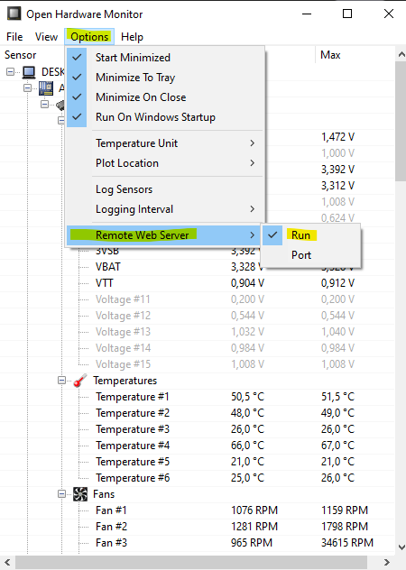

# Power-Meter

Power-Meter is an OpenHardwareMonitor client that calculates approximate electricity cost and consumption. This program is not for exact calculation. If you need exact consumption metrics, consider buying a kill-a-watt device.

## Installation

Firstly, install [openhardwaremonitor](https://openhardwaremonitor.org/downloads/) and make sure remote web server on port `8085` enabled. If you change the port, do not forget to change in global variables too. OpenHardwareMonitor should be running background.



You need to set your device sensor paths and other variables for proper calculation. You can split children with underscore. This means that ``Cpu Package`` under ``Power`` under ``AMD Ryzen 7 3700X`` on OpenHardwareMonitor GUI. 

You can add positive or negative offset watt for ram, motherboard and other peripherals that don't too much fluctuate power consumption according to your usage.
- Around 3 W of power for every 8 GB of DDR3 or DDR4 memory can be allocated.
- Around 30 W for regular motherboard, 65 W for high-end motherboard can be allocated.
- According to these; I've 32 GB DDR4 ram with high-end motherboard; so I've set (3 W * 4) for ram and 65 W for motherboard.


```bash
# clone project
go install .
```

## Usage

```bash
power-meter --help
Usage of power-meter:
  -cpu-power-path string
        cpu power metric path on open hardware monitor gui seperated with under score (default "AMD Ryzen 7 3700X_Powers_CPU Package")
  -currency string
        currency (default "TL")
  -fan-count int
        fan count (default 5)
  -gpu-power-path string
        gpu power metric path on open hardware monitor gui seperated with under score (default "NVIDIA NVIDIA GeForce RTX 2070 SUPER_Powers_GPU Power")
  -hdd-count int
        hdd count (default 3)
  -offset float
        positive or negative offset watt for ram, motherboard and other peripherals that don't too much fluctuate power consumption according to your usage. (default 77)
  -port string
        open hardware monitor web service port (default "8085")
  -price float
        price per kWh (default 0.85)
  -usb-count int
        usb count (default 4)
```
## Roadmap & Known Issues
- [ ] Dynamic parsing according to path.

## Contributing
Pull requests are welcome. For major changes, please open an issue first to discuss what you would like to change.

Please make sure to update tests as appropriate.

## License
[MIT](https://choosealicense.com/licenses/mit/)